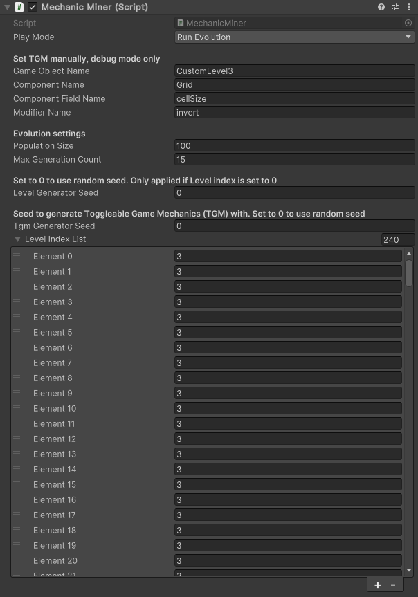
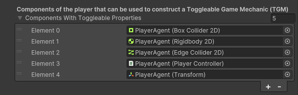
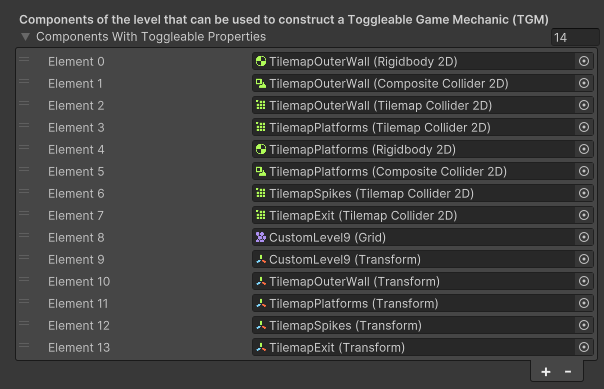

# Mechanic Miner 2023

Mechanic Miner 2023 is a co-creative game design tool for game developers that suggests game design ideas by exploring the source code of the game itself. It creates game mechanics from the game's source code using code reflection and evaluates these automatically using the state-of-the-art automated game-playing algorithm Go-Explore[^1]. Mechanic Miner 2023 can generate a diverse set of novel solutions for a simple 2D puzzle platformer within a time frame that suits iterative creative work.

This work is part of a master thesis paper titled *[Mechanic Miner 2023: Reflection-Driven Game
Mechanic Discovery Powered by Go-Explore](./docs/Mechanic%20Miner%202023%20Reflection-Driven%20Game%20Mechanic%20Discovery%20Powered%20by%20Go-Explore%20-%20Niels%20Poldervaart%20(2024).pdf)* by Niels NTG Poldervaart, supervised by Rob Saunders and Michael Cook. Mechanic Miner 2023 (MM23) re-implements parts of the system described in a 2013 paper by Michael Cook, Simon Colton, Azalea Raad and Jeremy Gow titled *Mechanic Miner: Reflection-Driven Game Mechanic Discovery and Level Design*[^2] (MM13) with a number of enhancements. Firstly, MM23 does not implement the procedural level generator which co-evolves levels with discovered game mechanics. Secondly, it’s implemented in Unity, a popular and robust game development environment, as opposed to Flixel. Thirdly, the number of supported data types and modifiers for TGMs has been expanded compared to MM13. Finally, the game-playing subsystem is driven by the state-of-the-art Go-Explore method.

## Demonstration

Below are two demonstrations of MM23 running on simple 2D platformer levels that's impossible to solve the "normal" way (move left, move right, jump). MM23 creates game mechanics that help the player agent solve the level by applying modifiers (add, subtract, double, half, invert) to values of the properties in the components attached to the player and level game objects. It does this for a population of 100 genotypes, which each get evaluated by running a game-playing agent in an independent simulation, all running in parallel. If it cannot reach the level exit before a set maximum number of actions, the genotype gets removed from the population.

For a more detailled explanation of the system and a breakdown of the results, please read the [paper](./docs/Mechanic%20Miner%202023%20Reflection-Driven%20Game%20Mechanic%20Discovery%20Powered%20by%20Go-Explore%20-%20Niels%20Poldervaart%20(2024).pdf)!

https://github.com/user-attachments/assets/acfab74c-d4f7-4346-958e-784acf966dba

⚠ `WARNING: VIDEO CONTAINS FLASHING IMAGES!` ⚠
Video of MM23 running in real time in a level with a solid wall separating the level start from the level exit. You can see a large diversity in the ways MM23 finds solutions around this obstacle, such as:

- At `0:01`: Size of the level's grid is halved, meaning all tiles are packed close together in a space half the level's original size. In this state the player can touch the level exit if it moves just a few steps to the right from its starting position.
- At `0:50`: Agent teleports to the other side by doubling the value of its current position.
- At `0:54`: Agent disables collision on dividing wall, enabling the agent to just walk to the level exit as if the wall isn't there.
- At `1:20`: Agent translates the dividing wall up by 1 unit, enabling the agent to walk to level exit through a small opening.

Demonstration of MM23 running on a level with a deadly pit that's too wide to jump over. Some members of the population discover the ability to invert gravity, disable gravity or teleport across the pit.

## Usage

### Prerequisites

- Unity version 2023.1, which can be obtained with the [Unity Hub](https://unity.com/unity-hub) (recommended) or the [Unity downloads archive](https://unity.com/releases/editor/archive).

### Project structure

The project contains to scenes:

- `Assets/Scenes/MasterScene`
  - Contains the `MechanicMiner` object, which controls the MM23 system.
    - The play mode "Run Evolution" runs the genetic algorithm with the current "Evolution Settings" for each level in the "Level Index List".
    - The play mode "Test Game Playing Agent" runs the automated game-playing agent in the first level of the "Level Index List" with a TGM defined in the "Set TGM manually, debug mode only" section.
    - The play mode "Manual Mode" lets you control the player in the first level of the "Level Index List" with a TGM defined in the "Set TGM manually, debug mode only" section.
      
- `Assets/Scenes/SimulationScene`
  - Contains the `SimulationSceneController` prefab, which has the `SimulationInstanceController` component. This component contains a list of levels the simulator can be run on. More levels can be added. It also has a slider that controls the physics time scale of the simulation. Be warned that setting this past the default value of `10f` may make the simulation behave erratically.
    - Contains the player agent game object.
      - Has a list of components of the player object that can be used to construct a Toggleable Game Mechanic (TGM). This list can be modified,  which changes to scope of the code domain MM23 can explore.
        
    - Contains `GeneratedLevel`, an empty level with a simple PCG level generator script. Not implemented in MM23.
    - Contains 9 hand-authored levels.
      - The root game object of each level has a list of components of the level that can be used to construct a Toggleable Game Mechanic (TGM). This list can be modified, which changes to scope of the code domain MM23 can explore.
        

## Acknowledgements

- All sprite graphics are from the "[1-Bit Platformer Pack](https://kenney.nl/assets/1-bit-platformer-pack)", created and distributed by [Kenney]((www.kenney.nl)) under a Creative Commons Zero license.
- Evolutionary algorithm is implemented using [Genetic Sharp](https://github.com/giacomelli/GeneticSharp) version 2.6.0 by [Diego Giacomelli](https://github.com/giacomelli).

[^1]: A. Ecoffet, J. Huizinga, J. Lehman, K. O. Stanley, and J. Clune, “First return, then explore,” Nature, vol. 590, no. 7847, p. 580–586, Feb. 2021. DOI: https://doi.org/10.1038/s41586-020-03157-9
[^2]: M. Cook, S. Colton, A. Raad, and J. Gow, “Mechanic miner: Reflection-driven game mechanic discovery and level design,” in Applications of Evolutionary Computation, ser. EvoApplications 2013. Springer, 2013, pp. 284–293. DOI: https://doi.org/10.1007/978-3-642-37192-9_29
